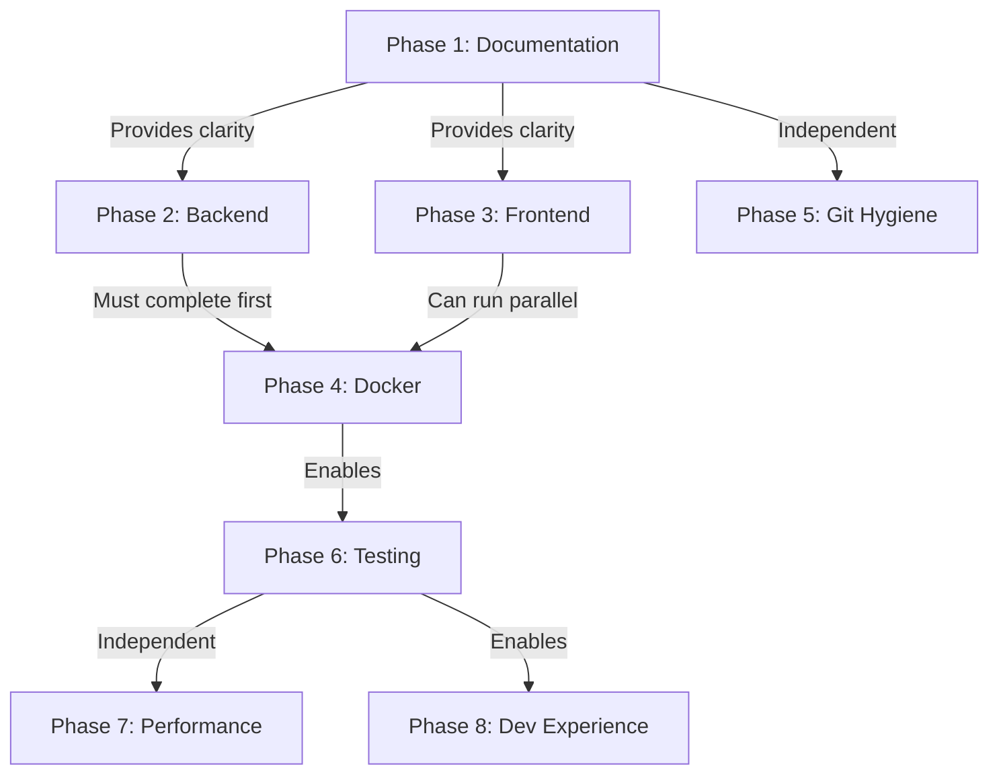

# SFPLiberate Cleanup & Optimization Plan
**Pre-Alpha Greenfield Refactor**
**Date:** November 4, 2025
**Status:** Draft for Review

---

## Executive Summary

The SFPLiberate codebase has successfully transitioned from vanilla JavaScript to Next.js 16 and has begun backend modernization with SQLAlchemy/Poetry. However, the transition is **incomplete and inconsistent**, leaving the codebase in a hybrid state with:

- **Dual backend implementations** (old SQLite vs new SQLAlchemy - old is active!)
- **Severely outdated documentation** (CLAUDE.md describes non-existent vanilla JS)
- **Duplicate files and conflicting configurations**
- **No Alembic migrations** despite having SQLAlchemy models
- **Corrupted README.md** with garbled text
- **40+ documentation files** with contradictory information

This plan assumes **pre-alpha greenfield status** and proposes aggressive cleanup without migration compatibility concerns.

---

## Critical Issues Requiring Decisions

### 🚨 DECISION #1: Which Backend Implementation?

**Current State:**
- `docker-compose.yml` line 11 references `Dockerfile.new`
- `Dockerfile.new` line 53 runs `uvicorn app.main:app` (NEW implementation)
- BUT `alembic/versions/` is **EMPTY** - no migrations exist
- Old `main.py` + `database_manager.py` still present and functional
- `database_factory.py` routes to OLD managers despite Docker trying to use NEW

**The Problem:**
The Docker setup claims to use the new SQLAlchemy backend, but:
1. No Alembic migrations exist to create tables
2. database_factory.py still imports old managers
3. Old files not marked for removal

**Options:**

**Option A: Commit to NEW (SQLAlchemy) Backend** ✅ RECOMMENDED
- Create initial Alembic migration from models
- Remove old `main.py`, `database_manager.py`, `appwrite_database_manager.py`, `database_factory.py`
- Update all imports to use `app.repositories` pattern
- Standardize on modern patterns (repositories, services, Pydantic v2)
- **Pros:** Future-proof, testable, follows best practices
- **Cons:** Requires creating migrations, testing migration path

**Option B: Revert to OLD (Direct SQLite) Backend**
- Remove entire `/backend/app/` directory
- Remove Alembic setup
- Keep `main.py` as canonical
- Update `Dockerfile.new` to run old main.py
- **Pros:** Works today, simpler
- **Cons:** Technical debt, harder to test, no type safety

**Recommendation:** **Option A** - The new backend is 80% complete. Finish it properly.

---

### 🚨 DECISION #2: ESPHome Proxy Networking

**Current State:**
- `.env` has `ESPHOME_PROXY_MODE=true` (enabled by default)
- `docker-compose.yml` line 38 has `ESPHOME_PROXY_MODE=${ESPHOME_PROXY_MODE:-false}` (disabled by default)
- CLAUDE.md line 38 says "requires host networking"
- `docker-compose.esphome.yml` ONLY sets frontend to host networking
- Backend stays in bridge mode

**The Problem:**
Three different defaults across three files. Host networking only partial.

**Options:**

**Option A: ESPHome OFF by Default** ✅ RECOMMENDED
- Set `.env` to `ESPHOME_PROXY_MODE=false`
- Document as opt-in feature
- Keep compose override for users who enable it
- **Rationale:** Most users have Web Bluetooth in Chrome/Edge

**Option B: ESPHome ON by Default**
- Set docker-compose default to `true`
- Make host networking the default
- **Rationale:** Better iOS/Safari support out of box

**Recommendation:** **Option A** - Web Bluetooth should be primary path. ESPHome for edge cases.

---

### 🚨 DECISION #3: Appwrite Dual-Deployment

**Current State:**
- `appwrite_database_manager.py` exists (315 lines)
- Frontend has `/src/lib/appwrite/` with client code
- `database_factory.py` supports routing to Appwrite
- CLAUDE.md claims "Appwrite cloud deployment" is a permanent mode
- But no Appwrite-specific CI/CD or deployment docs

**The Problem:**
Appwrite code exists but unclear if actively maintained or tested.

**Options:**

**Option A: Remove Appwrite (Focus on Standalone)**
- Delete `appwrite_database_manager.py`
- Delete `/frontend/src/lib/appwrite/`
- Remove Appwrite references from docs
- **Pros:** Simplifies codebase, removes untested code
- **Cons:** Kills cloud deployment path

**Option B: Keep Appwrite (Dual-Deployment)**
- Fix and test Appwrite integration
- Create CI/CD for Appwrite deployments
- Document deployment process
- **Pros:** Preserves cloud option
- **Cons:** Doubles maintenance burden

**Option C: Move Appwrite to Separate Branch**
- Keep standalone as `main`
- Create `appwrite` branch for cloud deployment
- Document divergence
- **Pros:** Keeps option alive without complexity
- **Cons:** Branches drift over time

**Recommendation:** Need user input - is cloud deployment important for pre-alpha?

---

## Phase 1: Documentation & Truth (IMMEDIATE)

### 1.1 Fix README.md Corruption 🚨
**File:** `/README.md`
**Issue:** Lines 5-45 have garbled, duplicated text making it unreadable
**Action:**
- Rewrite with clean structure
- Remove all duplication
- Match current architecture (Next.js frontend, FastAPI backend, Docker deployment)
- Add clear quick-start section
- Remove BLE Proxy references (replaced by ESPHome)

**Estimated Effort:** 1 hour

---

### 1.2 Complete CLAUDE.md Rewrite 🚨
**File:** `/CLAUDE.md`
**Issue:** Describes non-existent vanilla JS architecture, claims nginx exists, wrong file paths
**Action:**

**Remove These Sections (No Longer Exist):**
- Lines 213-241: Frontend files (script.js, index.html, style.css, nginx.conf)
- Line 242: "Frontend Dockerfile uses NGINX"
- Line 250: Old API endpoints without versioning
- References to "vanilla JS" throughout

**Rewrite These Sections:**
- **"Architecture" (lines 127+)**: Next.js 16 App Router, TypeScript, React 19, shadcn/ui
- **"Key Files"**: Update to reference actual structure:
  - Frontend: `/src/app/`, `/src/components/`, `/src/lib/`
  - Backend: `/backend/app/` (new) vs `/backend/*.py` (old) - note which is active
  - Docker: Single Dockerfile per service, no nginx
- **"API Endpoints"**: Add `/api/v1/` endpoints from new backend
- **"BLE Protocol"**: Update with ESPHome WebSocket flow
- **"Deployment Modes"**: Clarify that Next.js handles reverse proxy, not nginx

**Add These Sections:**
- **"Frontend Architecture"**: Next.js App Router, TypeScript, React Server Components
- **"Component Structure"**: BLE, ESPHome, Modules, Auth, Layout
- **"API Client Patterns"**: Backend API abstraction, ESPHome WebSocket client
- **"Docker Networking"**: Bridge by default, host override for ESPHome

**Update These Claims:**
- Line 38: ESPHome "requires host networking" → Only frontend needs host mode
- Line 127-157: "Ideal User Flow" → Update for Next.js UI
- Line 38: "ESPHome is optional" → Clarify actual default per decision above

**Estimated Effort:** 3-4 hours

---

### 1.3 Documentation Audit & Consolidation
**Location:** `/docs/` (40+ markdown files)
**Issue:** Redundant, contradictory, outdated documents
**Action:**

**Delete These (Obsolete/Redundant):**
- `NEXTJS_REWRITE_EPIC.md` - Rewrite is complete
- `NEXTJS_REWRITE_SUMMARY.md` - Historical, no longer relevant
- `NEXTJS_ROADMAP.md` - Pre-alpha doesn't need roadmap docs
- `STORY_001_COMPLETE.md` - Completed story artifacts
- `PHASE1_FIXES_SUMMARY.md` - Historical
- `PHASE2_FIXES_SUMMARY.md` - Historical
- `TESTING_PHASE1.md` - Outdated test docs
- `CODE_REVIEW_FINDINGS.md` - Findings should be in issues or resolved
- `ISSUES_CREATED.md` - Meta-doc, not needed
- `GITHUB_ISSUES_GUIDE.md` - Standard GitHub workflow
- `UPDATES_2025_11_02.md` - Historical changelog

**Consolidate These (Duplicates):**
- `ESPHOME_INTEGRATION.md` + `ESPHOME_PROXY_README.md` + `ESPHOME_IMPLEMENTATION.md` + `ESPHOME_IMPLEMENTATION_STATUS.md`
  → Merge into single `ESPHOME.md`
- `APPWRITE_DEPLOYMENT.md` + `APPWRITE_SITES_DEPLOYMENT.md` + `APPWRITE_DATABASE.md` + `APPWRITE_DATABASE_IMPLEMENTATION.md`
  → Merge into `APPWRITE.md` (or delete if removing Appwrite)
- `BLUETOOTH_README.md` + `BLUETOOTH_MIGRATION_GUIDE.md` + `BLUETOOTH_TESTING_GUIDE.md` + `BLUETOOTH_DISCOVERY_REFACTOR.md`
  → Merge into `BLUETOOTH.md`
- `DOCKER_DEPLOYMENT.md` + `DEPLOYMENT.md` + `PUBLIC_DEPLOYMENT.md`
  → Merge into single `DEPLOYMENT.md`
- `MODERNIZATION_PROPOSAL.md` + `MODERNIZATION_SUMMARY.md` + `MIGRATION_GUIDE.md` + `IMPLEMENTATION_STATUS.md`
  → Delete (modernization in progress, not finished)

**Keep and Update:**
- `BLE_API_SPECIFICATION.md` - Core reference ✅
- `ENVIRONMENT_VARIABLES.md` - Useful, needs update
- `AUTH_SYSTEM.md` - If auth is implemented
- `NEXTJS_FILE_STRUCTURE.md` - Good onboarding doc
- `BUILD_OPTIMIZATION_SUMMARY.md` - Useful reference

**Result:** ~40 files → **~8-10 essential docs**

**Estimated Effort:** 4-6 hours

---

## Phase 2: Backend Cleanup (HIGH PRIORITY)

### 2.1 Commit to New Backend + Create Migrations
**Assumption:** Decision #1 → Option A (use new SQLAlchemy backend)
**Action:**

1. **Create Initial Alembic Migration**
   ```bash
   cd backend
   poetry run alembic revision --autogenerate -m "Initial schema"
   ```
   - Review generated migration
   - Test upgrade/downgrade

2. **Remove Old Backend Files**
   - Delete `/backend/main.py` (259 lines)
   - Delete `/backend/database_manager.py` (122 lines)
   - Delete `/backend/appwrite_database_manager.py` (315 lines) [if removing Appwrite]
   - Delete `/backend/database_factory.py` (52 lines)
   - Delete `/backend/migrate_to_appwrite.py` (executable script)
   - Delete `/backend/sfp_parser.py` (keep only `app/services/sfp_parser.py`)

3. **Update Docker Configuration**
   - Rename `Dockerfile.new` → `Dockerfile`
   - Delete `Dockerfile.old`
   - Ensure Alembic migrations run on startup (already in CMD line 53)

4. **Update Tests**
   - Ensure tests run against new backend
   - Add integration tests for API v1 endpoints

**Files Changed:**
- ❌ Delete: 6 files
- 📝 Rename: `Dockerfile.new` → `Dockerfile`
- ✅ Create: Initial Alembic migration

**Estimated Effort:** 3-4 hours

---

### 2.2 Standardize Backend Structure
**Action:**

1. **Remove Duplicate sfp_parser.py**
   - Keep: `/backend/app/services/sfp_parser.py`
   - Delete: `/backend/sfp_parser.py`
   - Update any imports (should be none if old main.py deleted)

2. **Standardize Configuration**
   - Review `/backend/app/config.py`
   - Ensure all env vars documented in `ENVIRONMENT_VARIABLES.md`
   - Remove unused config options

3. **Audit Services**
   - `/backend/app/services/esphome/` - Verify all files needed
   - Check for unused imports, dead code
   - Ensure consistent error handling

**Estimated Effort:** 2 hours

---

### 2.3 Requirements Cleanup
**Current State:**
- `requirements.txt` = 9 lines (minimal, doesn't match pyproject.toml)
- `pyproject.toml` = 50+ dependencies
- Old `Dockerfile` uses `requirements.txt`
- New `Dockerfile.new` exports from Poetry

**Action:**
- Delete `requirements.txt` (no longer needed with Poetry)
- Ensure `Dockerfile` uses Poetry export (already does in line 21)
- Review dependencies in `pyproject.toml`:
  - Remove unused packages
  - Update to latest compatible versions
  - Document extras (`esphome-proxy`, `ble-proxy`)

**Estimated Effort:** 1 hour

---

## Phase 3: Frontend Cleanup (MEDIUM PRIORITY)

### 3.1 Registry Folder Audit
**Location:** `/frontend/src/registry/` (1.2MB)
**Issue:** Contains 16 sidebar variations, 5 login forms, chart templates from shadcn/ui
**Action:**

**Option A: Remove Entirely**
- If UI is finalized and registry not used
- **Pros:** Saves 1.2MB
- **Cons:** Lose template reference

**Option B: Keep Essentials, Remove Duplicates**
- Audit which components are actually imported
- Keep only used templates
- **Pros:** Keeps useful references
- **Cons:** Requires thorough audit

**Option C: Move to Separate Repo/Branch**
- Extract to `SFPLiberate-ui-templates` repo
- **Pros:** Available but not in main codebase
- **Cons:** Extra maintenance

**Recommendation:** **Option A** - shadcn/ui docs have templates. No need to vendor.

**Estimated Effort:** 30 min to delete, 3 hours to audit

---

### 3.2 Remove Unused Bun Dockerfile
**File:** `/frontend/Dockerfile.bun`
**Action:** Delete (unused alternative runtime)

**Estimated Effort:** 5 minutes

---

### 3.3 Component Organization Audit
**Action:**
- Review `/frontend/src/components/` structure
- Check for:
  - Unused components
  - Duplicate logic (e.g., multiple BLE connection components)
  - Inconsistent naming patterns
- Consolidate where possible

**Example Issues to Check:**
- Are both `/components/ble/` and `/components/esphome/` used?
- Any leftover vanilla JS conversion artifacts?
- Consistent use of TypeScript types vs `any`

**Estimated Effort:** 2-3 hours

---

### 3.4 Type Safety Audit
**Action:**
- Run TypeScript compiler in strict mode
- Fix any `any` types
- Ensure all API responses have Zod schemas or types
- Check ESPHome WebSocket message types

**Estimated Effort:** 2-3 hours

---

## Phase 4: Docker & Configuration (MEDIUM PRIORITY)

### 4.1 Standardize Docker Compose
**Action:**

1. **Fix ESPHome Default** (per Decision #2)
   - Set consistent default across `.env` and `docker-compose.yml`
   - Document the override file usage
   - Test both modes (bridge + host)

2. **Rename docker-compose.esphome.yml**
   - Consider renaming to `docker-compose.host-network.yml` (more descriptive)
   - OR merge as profile: `docker-compose --profile esphome up`

3. **Review Networking Configuration**
   - Backend on bridge: `172.25.0.0/24` subnet
   - Frontend proxy: `http://backend:80` via DNS
   - ESPHome override: Frontend on host network
   - Ensure subnet doesn't conflict with common LAN ranges

4. **Add docker-compose.override.yml.example**
   - Template for user customizations
   - Document common overrides (ports, volumes, env vars)

**Estimated Effort:** 2 hours

---

### 4.2 Environment Variable Consistency
**Files:** `.env`, `docker-compose.yml`, `backend/app/config.py`, `frontend/next.config.ts`
**Action:**

1. **Create Comprehensive .env.example**
   - Document all variables
   - Provide safe defaults
   - Group by service (Backend, Frontend, ESPHome, Deployment)

2. **Audit Variable Usage**
   - Backend reads from `app/config.py`
   - Frontend reads from `next.config.ts` + runtime
   - Ensure no hardcoded values that should be configurable

3. **Standardize Naming**
   - Backend: `DATABASE_FILE`, `LOG_LEVEL`, `ESPHOME_PROXY_MODE`
   - Frontend: `NEXT_PUBLIC_*` for client-side
   - Deployment: `DEPLOYMENT_MODE`, `ENVIRONMENT`

**Current Issues:**
- `.env` only has ESPHome + UUID config (14 lines)
- Missing: `BACKEND_HOST_PORT`, `FRONTEND_HOST_PORT`, `LOG_LEVEL`, etc.

**Estimated Effort:** 2 hours

---

### 4.3 Health Check Improvements
**Current State:**
- Backend healthcheck (line 67): Python urllib call to `/api/modules`
- Frontend healthcheck (line 131): Node.js http call to `/`

**Issues:**
- Backend check hits specific endpoint (may fail if DB broken)
- No health endpoint in new backend

**Action:**
- Add `/health` endpoint to backend (lightweight, no DB)
- Update healthcheck to use `/health` or `/api/v1/health`
- Consider adding readiness vs liveness checks

**Estimated Effort:** 1 hour

---

## Phase 5: Git & Repository Hygiene (LOW PRIORITY)

### 5.1 Update .gitignore
**Action:**
- Ensure all build artifacts ignored
- Check for committed files that shouldn't be:
  - `.env` (currently committed - should be `.env.example` only?)
  - `/data/` directory
  - `__pycache__`, `node_modules`, `.next/`, `dist/`
  - Poetry/npm cache files

**Estimated Effort:** 30 minutes

---

### 5.2 Branch Cleanup
**Current Branch:** `fix/docker-networking`
**Action:**
- Merge to `main` after testing
- Delete merged feature branches
- Consider branch protection rules

**Estimated Effort:** 15 minutes

---

## Phase 6: Code Quality & Testing (LOW PRIORITY)

### 6.1 Backend Test Coverage
**Current State:**
- 6 test files in `/backend/tests/`
- Tests exist for modernized backend
- Unknown if tests run in CI

**Action:**
- Run pytest with coverage: `poetry run pytest --cov=app`
- Target 70%+ coverage
- Add missing tests for:
  - ESPHome proxy service
  - API v1 endpoints
  - Repository layer

**Estimated Effort:** 4-6 hours

---

### 6.2 Frontend Test Setup
**Current State:**
- Minimal tests in `/frontend/src/tests/`
- No Jest/Vitest config visible

**Action:**
- Set up Vitest (faster than Jest for Vite/Next.js)
- Add unit tests for:
  - BLE manager
  - ESPHome client
  - API client
- Add integration tests for key user flows

**Estimated Effort:** 6-8 hours (if starting from scratch)

---

### 6.3 Linting & Formatting
**Backend:**
- Already has pre-commit hooks
- Ensure running: ruff, black, mypy

**Frontend:**
- Check for ESLint config
- Add Prettier if not present
- Configure for TypeScript strict mode

**Action:**
- Document linting setup in CONTRIBUTING.md
- Add to CI pipeline

**Estimated Effort:** 2 hours

---

## Phase 7: Performance & Optimization (NICE TO HAVE)

### 7.1 Frontend Bundle Analysis
**Action:**
- Run bundle analyzer: `BUNDLE_ANALYZER_ENABLED=true npm run build`
- Check for:
  - Duplicate dependencies
  - Oversized packages
  - Unused re-exports
- Consider lazy loading for:
  - BLE connection components
  - ESPHome proxy UI
  - Module library (if large)

**Estimated Effort:** 2-3 hours

---

### 7.2 Docker Image Size
**Current Sizes:** (Unknown, need to measure)
**Action:**
- Build and measure: `docker images sfpliberate-*`
- Optimize:
  - Multi-stage builds (already done ✅)
  - Remove unnecessary files in final stage
  - Use alpine base images if possible
- Target: Backend <150MB, Frontend <200MB

**Estimated Effort:** 2-3 hours

---

### 7.3 Database Optimization
**Action:**
- Add indices on frequently queried columns
- Review SFP module schema for normalization
- Consider adding full-text search for module names
- Add pagination to `/api/v1/modules` endpoint

**Estimated Effort:** 2-3 hours

---

## Phase 8: Developer Experience (NICE TO HAVE)

### 8.1 Create CONTRIBUTING.md
**Action:**
- Document:
  - How to set up development environment
  - Code style guidelines
  - How to run tests
  - How to submit PRs
  - Branch naming conventions

**Estimated Effort:** 1-2 hours

---

### 8.2 Add Makefile
**Action:**
- Common commands:
  - `make dev` - Start dev environment
  - `make test` - Run all tests
  - `make lint` - Run linters
  - `make clean` - Clean build artifacts
  - `make migrate` - Run database migrations

**Estimated Effort:** 1 hour

---

### 8.3 VS Code Configuration
**Action:**
- Add `.vscode/settings.json` with:
  - Python interpreter path
  - TypeScript settings
  - Recommended extensions
- Add `.vscode/launch.json` for debugging

**Estimated Effort:** 30 minutes

---

## File Deletion Checklist

### 🗑️ Backend Files to Delete

**Dockerfiles:**
- [ ] `/backend/Dockerfile` (replace with Dockerfile.new)
- [ ] `/backend/Dockerfile.old`

**Old Backend Implementation:**
- [ ] `/backend/main.py` (if using new backend)
- [ ] `/backend/database_manager.py`
- [ ] `/backend/database_factory.py`
- [ ] `/backend/migrate_to_appwrite.py`
- [ ] `/backend/sfp_parser.py` (duplicate)

**Appwrite (if removing):**
- [ ] `/backend/appwrite_database_manager.py`

**Dependencies:**
- [ ] `/backend/requirements.txt`

**Total Backend Deletions:** 8-9 files

---

### 🗑️ Frontend Files to Delete

**Dockerfiles:**
- [ ] `/frontend/Dockerfile.bun`

**Shadcn Registry (if removing):**
- [ ] `/frontend/src/registry/` (entire directory, 1.2MB)

**Appwrite (if removing):**
- [ ] `/frontend/src/lib/appwrite/` (directory)

**Total Frontend Deletions:** 1-3 items

---

### 🗑️ Documentation Files to Delete

**Historical/Obsolete (~12 files):**
- [ ] `/docs/NEXTJS_REWRITE_EPIC.md`
- [ ] `/docs/NEXTJS_REWRITE_SUMMARY.md`
- [ ] `/docs/NEXTJS_ROADMAP.md`
- [ ] `/docs/STORY_001_COMPLETE.md`
- [ ] `/docs/PHASE1_FIXES_SUMMARY.md`
- [ ] `/docs/PHASE2_FIXES_SUMMARY.md`
- [ ] `/docs/TESTING_PHASE1.md`
- [ ] `/docs/CODE_REVIEW_FINDINGS.md`
- [ ] `/docs/ISSUES_CREATED.md`
- [ ] `/docs/GITHUB_ISSUES_GUIDE.md`
- [ ] `/docs/UPDATES_2025_11_02.md`
- [ ] `/docs/SIDECAR_SITE_TODO.md`

**To Consolidate (~16 files → 4 files):**
- [ ] ESPHome docs (4 files → 1)
- [ ] Appwrite docs (4 files → 1 or delete)
- [ ] Bluetooth docs (4 files → 1)
- [ ] Deployment docs (3 files → 1)
- [ ] Modernization docs (4 files → delete)

**Total Documentation Changes:** 28 files → ~8 files

---

### 📊 Overall Impact

**Before Cleanup:**
- Backend: ~30 files + 9 test files
- Frontend: ~200 files (with registry)
- Documentation: 40+ markdown files
- 3 Dockerfiles per service

**After Cleanup:**
- Backend: ~20 files + 9 test files
- Frontend: ~50 files (without registry)
- Documentation: ~8-10 markdown files
- 1 Dockerfile per service

**Estimated Reduction:**
- **Code Size:** ~1.5MB reduction (mostly registry)
- **File Count:** ~40% reduction
- **Complexity:** Significant reduction (single backend path, clear docs)

---

## Dependency Tree



**Blocking Dependencies:**
- Phase 2 (Backend) requires Decision #1
- Phase 3 (Frontend) requires Decision #3 (Appwrite)
- Phase 4 (Docker) requires Phase 2 completion
- Phase 6 (Testing) requires Phase 2 & 3 completion

**Independent Work:**
- Phase 1 (Documentation) can start immediately
- Phase 5 (Git) can run anytime
- Phase 7 (Performance) can run after Phase 6
- Phase 8 (DevEx) can run anytime

---

## Recommended Execution Order

### Week 1: Foundation & Decisions
1. **Make Decisions #1, #2, #3** (stakeholder approval)
2. **Phase 1.1:** Fix README.md corruption (1 hour)
3. **Phase 1.2:** Rewrite CLAUDE.md (4 hours)
4. **Phase 2.1:** Commit to new backend + migrations (4 hours)
5. **Phase 2.2:** Remove old backend files (1 hour)

**Total:** ~10 hours

---

### Week 2: Structure & Consistency
6. **Phase 1.3:** Documentation consolidation (6 hours)
7. **Phase 2.3:** Requirements cleanup (1 hour)
8. **Phase 4.1:** Docker compose standardization (2 hours)
9. **Phase 4.2:** Environment variables (2 hours)
10. **Phase 3.2:** Remove Bun Dockerfile (5 min)
11. **Phase 5.1:** Update .gitignore (30 min)

**Total:** ~12 hours

---

### Week 3: Quality & Refinement
12. **Phase 3.1:** Registry audit (choice dependent)
13. **Phase 3.3:** Component organization (3 hours)
14. **Phase 4.3:** Health check improvements (1 hour)
15. **Phase 6.1:** Backend test coverage (6 hours)
16. **Phase 6.3:** Linting setup (2 hours)

**Total:** ~12 hours

---

### Week 4: Polish & Optimization
17. **Phase 3.4:** Type safety audit (3 hours)
18. **Phase 7.1:** Bundle analysis (3 hours)
19. **Phase 7.2:** Docker image size (3 hours)
20. **Phase 8.1:** CONTRIBUTING.md (2 hours)
21. **Phase 8.2:** Makefile (1 hour)

**Total:** ~12 hours

---

## Success Criteria

### Must Have (MVP)
- ✅ README.md readable and accurate
- ✅ CLAUDE.md reflects actual architecture
- ✅ Single backend implementation (no dual code paths)
- ✅ All Dockerfiles standardized (one per service)
- ✅ Docker compose works in both modes (standalone + ESPHome)
- ✅ Documentation consolidated (<15 files)
- ✅ No corrupted or severely outdated docs

### Should Have
- ✅ Alembic migrations for new backend
- ✅ Backend test coverage >60%
- ✅ TypeScript strict mode passes
- ✅ .env.example comprehensive
- ✅ No duplicate files
- ✅ Registry folder decision implemented

### Nice to Have
- ✅ Frontend tests >50% coverage
- ✅ Bundle size optimized
- ✅ Docker images <300MB combined
- ✅ CONTRIBUTING.md complete
- ✅ Makefile for common commands

---

## Risk Assessment

### High Risk
- **Backend migration** - Could break existing functionality
  - **Mitigation:** Create Alembic migration from scratch, test thoroughly
- **Documentation rewrite** - Might introduce new errors
  - **Mitigation:** Have someone review against actual codebase

### Medium Risk
- **Removing Appwrite** - Loses cloud deployment option
  - **Mitigation:** Create separate branch first, can revert if needed
- **Registry deletion** - Might remove needed components
  - **Mitigation:** Audit usage first, keep in git history

### Low Risk
- **File deletions** - Everything in git history
- **Docker standardization** - Can revert easily
- **Documentation consolidation** - Old docs in git history

---

## Questions for User

Before proceeding, please confirm:

1. **Backend Implementation:** Use new SQLAlchemy backend (Option A) or keep old (Option B)?

2. **ESPHome Default:** Should ESPHome proxy be OFF by default (Option A - recommended) or ON (Option B)?

3. **Appwrite Decision:**
   - Remove Appwrite completely (Option A)?
   - Keep and fix Appwrite (Option B)?
   - Move to separate branch (Option C)?

4. **Registry Folder:** Delete shadcn/ui templates (Option A - recommended) or keep (Option B)?

5. **Deployment Priority:** Are you planning to deploy before alpha, or is this purely local development for now?

6. **Timeline:** Is 4-week timeline acceptable, or do you need faster turnaround on specific phases?

7. **Breaking Changes:** OK to break compatibility with any existing data/configs? (Should be YES for pre-alpha)

---

## Next Steps

1. **Review this plan** and confirm decisions above
2. **Prioritize phases** if timeline needs adjustment
3. **Create GitHub issues** for each phase (optional but recommended)
4. **Start with Phase 1** (Documentation) - non-breaking, high value
5. **Test thoroughly** after Phase 2 (Backend) before proceeding

---

## Appendix A: Architecture After Cleanup

### Backend
```
backend/
├── app/
│   ├── api/v1/          # REST endpoints
│   ├── core/            # Database, logging, config
│   ├── models/          # SQLAlchemy models
│   ├── repositories/    # Data access layer
│   ├── schemas/         # Pydantic schemas
│   └── services/        # Business logic + ESPHome
├── alembic/             # Database migrations
│   └── versions/        # Migration files (will exist)
├── tests/               # Unit + integration tests
├── Dockerfile           # Poetry-based build
├── pyproject.toml       # Dependencies + config
└── alembic.ini          # Migration config
```

### Frontend
```
frontend/
├── src/
│   ├── app/             # Next.js App Router pages
│   ├── components/      # React components
│   │   ├── ble/
│   │   ├── esphome/
│   │   ├── modules/
│   │   └── ui/          # shadcn/ui components
│   ├── lib/             # Utilities
│   │   ├── api/         # Backend client
│   │   ├── ble/         # Web Bluetooth
│   │   └── esphome/     # ESPHome client
│   └── types/           # TypeScript types
├── public/              # Static assets
├── Dockerfile           # Next.js standalone build
├── next.config.ts       # Dual deployment config
└── package.json         # Dependencies
```

### Documentation
```
docs/
├── DEPLOYMENT.md        # Docker + hosting
├── ESPHOME.md           # ESPHome proxy setup
├── BLUETOOTH.md         # BLE connection guide
├── BLE_API_SPECIFICATION.md  # Device API reference
├── ENVIRONMENT_VARIABLES.md  # Config reference
├── NEXTJS_FILE_STRUCTURE.md  # Code organization
├── AUTH_SYSTEM.md       # Authentication (if applicable)
└── BUILD_OPTIMIZATION_SUMMARY.md
```

### Root
```
/
├── backend/             # FastAPI backend
├── frontend/            # Next.js frontend
├── docs/                # Documentation
├── docker-compose.yml   # Main compose file
├── docker-compose.dev.yml          # Dev overrides
├── docker-compose.host-network.yml # ESPHome mode
├── .env.example         # Environment template
├── .gitignore           # Ignore rules
├── README.md            # Getting started
├── CLAUDE.md            # AI assistant context
├── CONTRIBUTING.md      # Contribution guide
└── Makefile             # Common commands
```

**Clean, Simple, Maintainable.**

---

**End of Plan**
